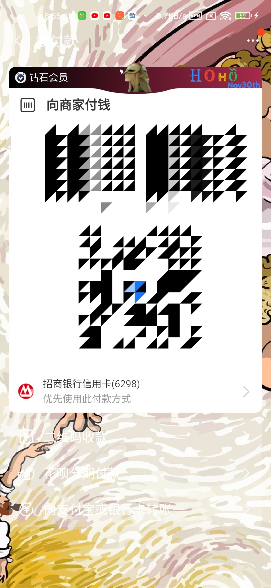
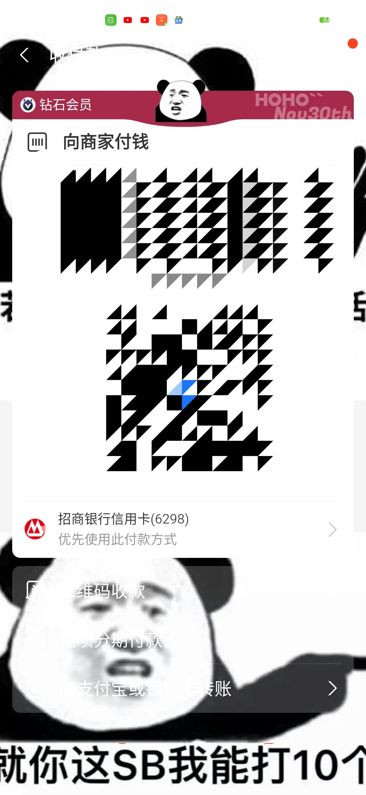
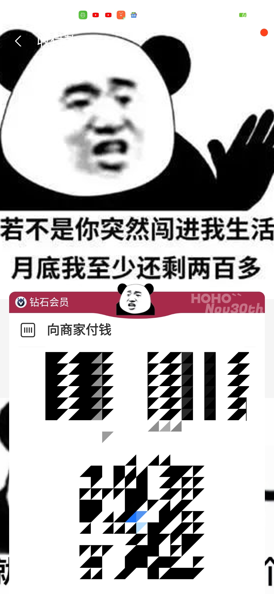
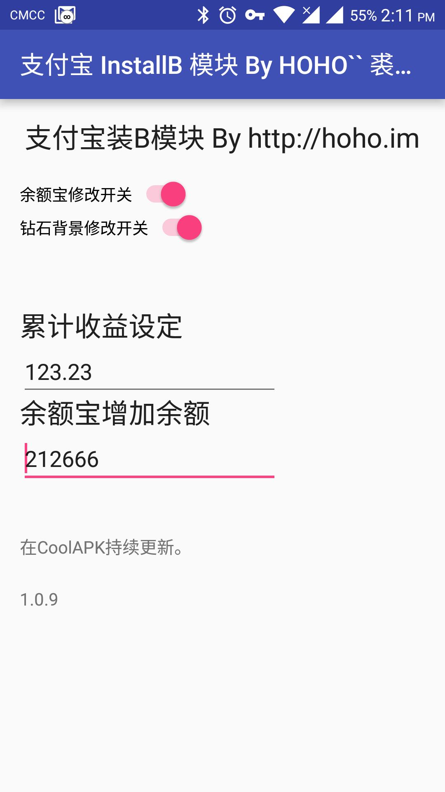
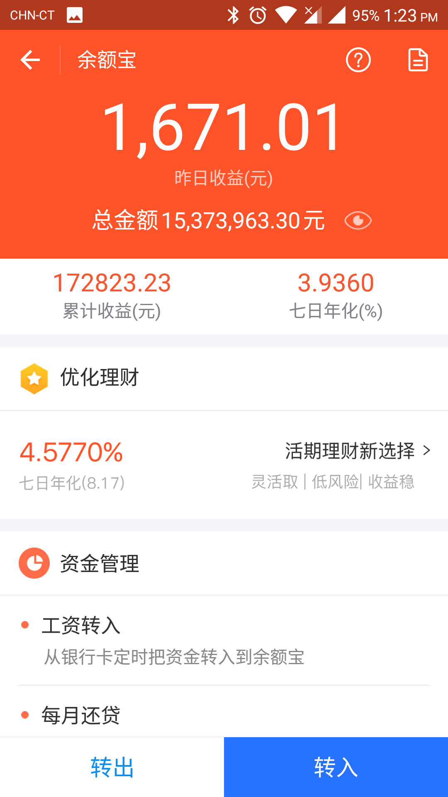
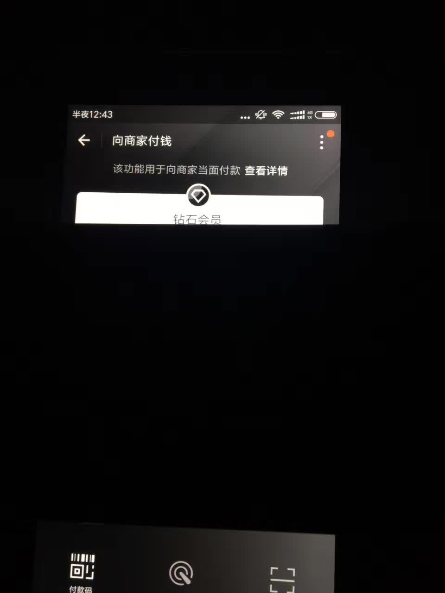

# 支付宝装X模块

Xposed module for Alipay App which makes you barcode payment interface same as Diamond members or customized skins.

这是一个Xposed模块，它可以让你的支付宝付款背景为黑色钻石会员样式或自定义皮肤。

## 2022.01功能更新
新增了自定义皮肤功能，包含随机更换皮肤功能（每次展示二维码随机使用一个自定义皮肤）

注意，模块没有界面操作，需有一定IT和美工经验。

### 自定义皮肤说明
- 更新装X模块2.4.0版本。
- 手动下载DEMO资源包，放入SD卡根目录既可。(**[SD CARD]**\000_HOHO_ALIPAY_SKIN)

### 目录结构说明

命名|所属目录|含义|是否目录|手动创建|作用后文件消失
---|---|---|---|---|---
actived|000_HOHO_ALIPAY_SKIN|开启自定义皮肤功能|随意|是|否
update|000_HOHO_ALIPAY_SKIN|触发支付宝增量自定义皮肤缓存|随意|是|是
delete|000_HOHO_ALIPAY_SKIN|触发支付宝删除自定义皮肤缓存|随意|是|是
任意名称目录|000_HOHO_ALIPAY_SKIN|自定义皮肤文件夹|是|是|否
任意名称文件|000_HOHO_ALIPAY_SKIN|无作用|否|是|否

> 通常情况下，创建 update文件 时，请同时创建 delete文件 干净清除。

> 触发仅在展示二维码时有效，使用手动触发机制非自动为避免频繁IO操作影响目标程序。

> 自定义皮肤开启后，账号皮肤数据不会被修改或影响，仅本地切换。

> 多个皮肤之间随机数切换，没有去重，看你手机心情展示。

内容|所属目录|含义
---|---|---
z01.0001|皮肤子目录|付款码背景
z02.0001|皮肤子目录|付款码卡头背景颜色
z02.0002|皮肤子目录|付款码卡头中间logo
z02.0003|皮肤子目录|付款码卡头右侧水印

***资源包已经包含3个作者画的DEMO与简单的PSD文件，请自行研究。***

## 2021.09更新
由于共享参数设置问题，之前版本在新版支付宝下会始终为默认初始大众会员。

作者时间原因及比较懒，直接去掉了设置界面，当前版本仅有单一的钻石会员背景。

## 2021.07酷市场
酷市场由于审核机制原因，2021年07月被下架。

## 以往的截图

## APK
Download Mirror [下载镜像]: https://hoho.im/2017/08/21/high-headsome-rich-uploaded/

【作者自用】
