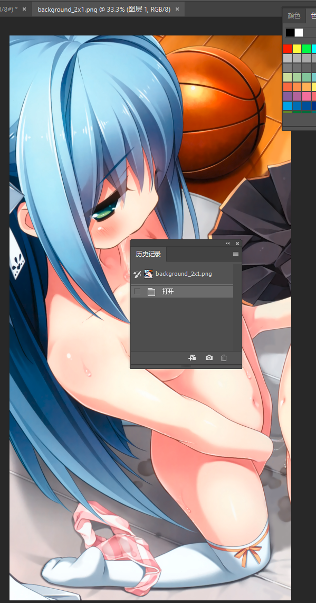
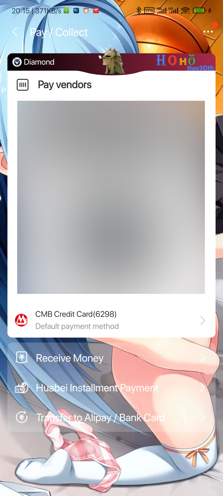

# 支付宝装X模块

Xposed module for Alipay App which makes you barcode payment interface same as Diamond members or customized skins.

这是一个Xposed模块，它可以让你的支付宝付款背景为黑色钻石会员样式或自定义皮肤。

*该模块作者仅在Xposed官方及LSPosed官方同步，其他途径下载请自行分析风险。*

|版本|功能|最后更新时间|是否可用
|---|---|---|---|
2.2.8|余额宝修改及收益自动计算、 自由选择支付宝付款码背景|2018.06|<=10.0.12
2.2.8|自由选择支付宝付款码背景|2018.06|<10.2.33
2.3.0|仅钻石付款背景|2021.09|所有版本
2.4.0|钻石背景或自定义皮肤|2022.01|>=10.2.23
2.4.2|钻石背景或自定义皮肤(含导出)|2023.09|>=10.2.23

### 自定义皮肤说明
- 手动下载DEMO资源包，放入SD卡根目录既可。(**[SD CARD]**\000_HOHO_ALIPAY_SKIN)
- **更新支付宝或者清除支付宝缓存后，需要在000_HOHO_ALIPAY_SKIN重新创建update文件夹（或文件）以更新缓存。**
- **第一次使用需手动修改支付宝权限给与存储卡读写功能以读取自定义界面配置**
### 目录结构说明

命名|所属目录|含义|是否目录|手动创建|作用后文件消失
-------|--------------------|-------------|---|---|---
actived|000_HOHO_ALIPAY_SKIN|开启自定义皮肤功能|随意|是|否
update|000_HOHO_ALIPAY_SKIN|触发支付宝增量自定义皮肤缓存|随意|是|是
delete|000_HOHO_ALIPAY_SKIN|触发支付宝删除自定义皮肤缓存|随意|是|是
export|000_HOHO_ALIPAY_SKIN|导出支付宝拥有皮肤|随意|是|是
任意名称目录|000_HOHO_ALIPAY_SKIN|自定义皮肤文件夹|是|是|否
任意名称文件|000_HOHO_ALIPAY_SKIN|无作用|否|是|否

> 通常情况下，创建 update文件夹 时，请同时创建 delete文件夹 干净清除。

> 触发仅在展示二维码时有效

> 自定义皮肤开启后，账号皮肤数据不会被修改或影响，仅本地切换。

> export文件夹建立后，展示二维码，成功便export文件夹消失，如需更新展示则仍然需要创建update或delete文件夹。

> 多目录存在时多个皮肤之间随机数切换，没有去重，看你手机心情展示。

***资源包已经包含3个作者画的DEMO与简单的PSD文件，请自行研究。***

## 快速手机修改背景步骤
1. 打开任意目录下background_2x1.png文件，修改图片为手机分辨率大小并替换图片。也可直接替换文件。
> 
2. 在000_HOHO_ALIPAY_SKIN目录下创建delete与update两个文件夹。
3. 打开支付宝付款码即可看到效果如图。
> 
4. 其他界面内元素同样。如不希望随机界面，删除000_HOHO_ALIPAY_SKIN下其他皮肤目录后，同样创建创建delete与update两个文件夹触发更新。

## 更新历史

[更新历史](Updates.md)

【作者自用】
