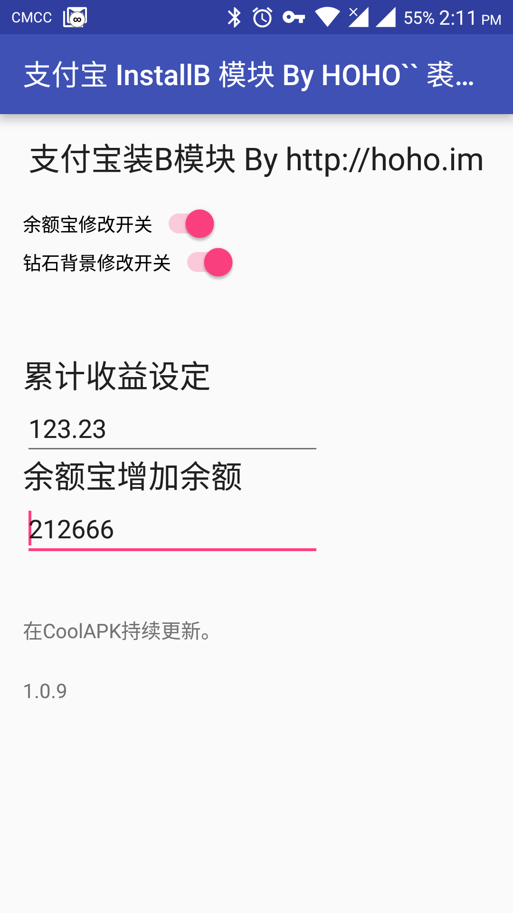
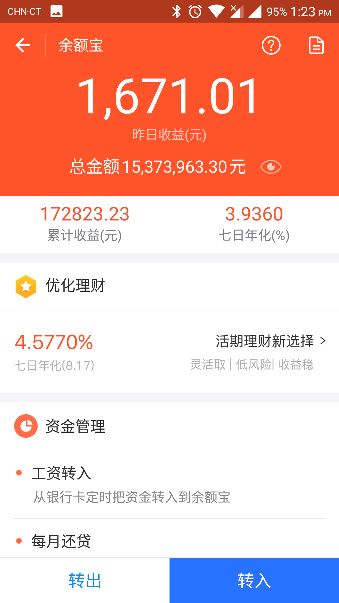
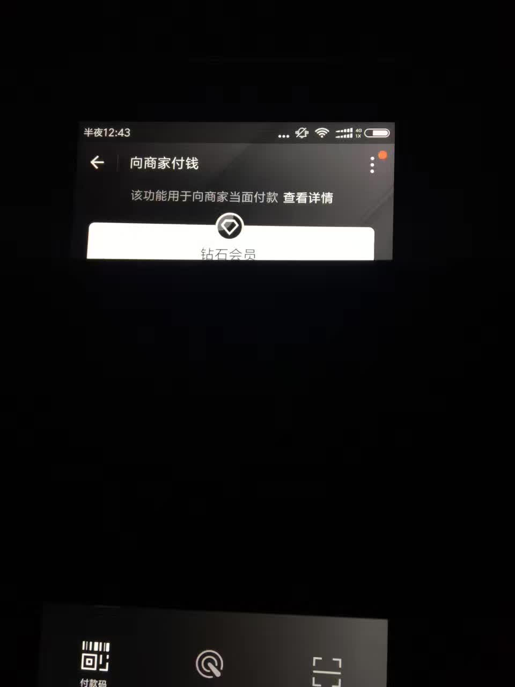

## 2026.05 Android 10 存储权限修复

修复 Android 10（API 29）上皮肤和主题文件可能无法写入的问题。

原因是 Android 10 对 targetSdk 29 及以上应用默认启用分区存储，而本模块需要继续通过文件路径访问 `Android/media/com.eg.android.AlipayGphone/000_HOHO_ALIPAY_SKIN`。本次在 Manifest 中加入 `requestLegacyExternalStorage`，让 Android 10 继续使用旧版外部存储访问方式。

同时优化主题导出触发方式：创建导出请求后，请打开支付宝付款码界面触发导出；如果支付宝主题缓存尚未准备好，请求标记会保留，后续再次进入付款码时继续尝试。

## 2026.05主题功能更新

新增 **主题** 标签页，支持导出支付宝当前账号已下发的 App 主题，并在本地保存到 `themes/` 文件夹。

主题卡片现在支持一键 **替换**、导出为 **Zip**、以及删除本地主题。替换是一次性请求：点击替换后显示“准备替换”，重新打开支付宝后模块会替换当前已启用主题的缓存文件，并自动清除请求标记。

新增 **HoHo皮肤修改器**，可在浏览器中直接修改本地付款皮肤和主题资源，并支持从主题中提取内含的付款皮肤。

注意：主题替换前，支付宝内必须已经启用过一个主题，否则模块无法定位当前主题缓存目录。

## 2024.10界面更新
使用Claude生成了界面，着实方便。

## 2023.11支付宝安卓框架更新
具体我也不了解，反正新版的Android不支持SD卡直接读写，然后支付宝更新后导致部分非媒体文件处理不了了。

然后做的这一版本更新，修改了存储位置。（chatgpt4真好用，嘎嘎一问就说出问题了）

## 2023.09杭州亚运更新
由于官方出了一些好看的皮肤，鉴于有过期日，增加导出功能，便可保存皮肤使用。

（使用请注意版权问题，作者仅提供专业人士研究分析目的）

## 2022.01功能更新
新增了自定义皮肤功能，包含随机更换皮肤功能（每次展示二维码随机使用一个自定义皮肤）

注意，模块没有界面操作，需有一定IT和美工经验。

## 2021.09更新
由于共享参数设置问题，之前版本在新版支付宝下会始终为默认初始大众会员。

作者时间原因及比较懒，直接去掉了设置界面，当前版本仅有单一的钻石会员背景。

## 2021.07酷市场
酷市场由于审核机制原因，2021年07月被下架。

## 以往的截图

## 第一版

源于2018年一同事买咖啡看到钻石会员背景很屌，本人便说给他做一个会员。
[酷安历史](https://hoho.im/2017/08/21/high-headsome-rich-uploaded/)
